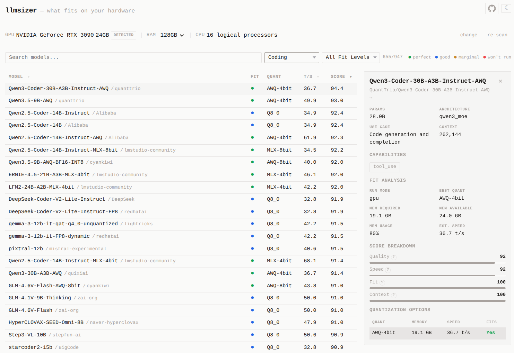

# llmsizer

Derived from [llmfit](https://github.com/AlexsJones/llmfit) — find which LLMs actually fit on your hardware. Try it at [llmsizer.com](https://llmsizer.com).



## What it does

- **Detects your GPU** via WebGL — no install required
- **Estimates memory** for each model across quantization levels (Q2_K through F16)
- **Predicts speed** (tokens/sec) based on your GPU's memory bandwidth
- **Scores and ranks** 5,000+ models by quality, speed, fit, and context length
- **Shows what fits** — perfect, good, marginal, or won't run

## Tech

Static React SPA — everything runs in your browser. No backend, no data collection.

Built with TypeScript, Vite, and a model database auto-updated weekly from HuggingFace.

## Run locally

```bash
npm install
npm run dev
```

## Test

```bash
npm test
```

## Regenerating the model database

`public/models.json` is generated by a Python scraper with a pre-quantized-repo sizing fix. Stdlib only — no pip deps.

```bash
# curated list only
python3 scripts/scrape_hf_models.py > public/models.json

# curated + top-N trending models (what's currently shipped)
python3 scripts/scrape_hf_models.py --discover -n 800 > public/models.json
```

For AWQ/GPTQ/MLX/BNB repos, the scraper sums real `.safetensors` file sizes
from the HF tree API and writes `weight_gb`, since HuggingFace's
`safetensors.total` reports packed-tensor element counts (~8× too small
for 4-bit quantized weights). The UI engine uses `weight_gb` directly when
present instead of applying a generic Q4_K_M formula.

To patch pre-quantized entries in an already-scraped `models.json`
without re-scraping, run:

```bash
python3 scripts/fix_quantized_entries.py
```

## License

MIT — see [LICENSE](LICENSE).

The scrapers in `scripts/` are derived from [llmfit](https://github.com/AlexsJones/llmfit) (MIT, © 2026 Alex Jones); the upstream notice is reproduced in [NOTICE](NOTICE).
